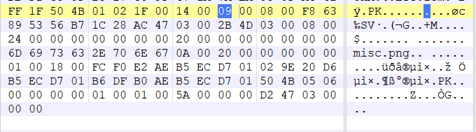
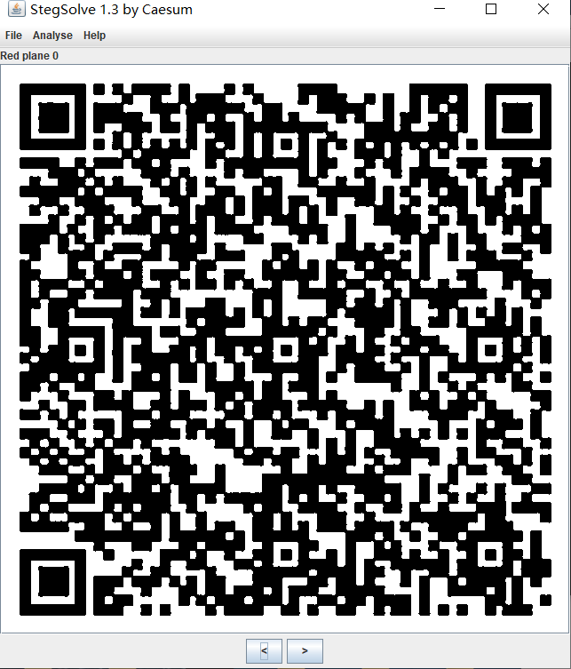

# WriteUp

## baby-mix

首先是个伪加密




将09改成00，压缩包就可以打开啦，打开后发现是一张图片


用stegslove打开，发现了一张二维码



然后得到了一串字符串

```
4a5a4a584732544748424658515654514f4634575135435447564a4749564a5347463455595754564f464c444f5752594f56465751334b55474a345841324b494b4a3546495533594b524a4449524b454b35435753334c324f4a41564153534f48424756515243574d355a464d3543474a593d3d3d3d3d3d
```

只有数字和字母，是base16加密，解密：

```
JZJXG2TGHBFXQVTQOF4WQ5CTGVJGIVJSGF4UYWTVOFLDOWRYOVFWQ3KUGJ4XA2KIKJ5FIU3YKRJDIRKEK5CWS3L2OJAVASSOHBGVQRCWM5ZFM5CGJY======
```

这是base32,解密：

```
NSsjf8KxVpqyhtS5RdU21yLZuqV7Z8uKhmT2ypiHRzTSxTR4EDWEimzrAPJN8MXDVgrVtFN
```

这是base58解密：

```
YXN1cml7aV90aGlua190aGF0X2lzX3NvX2Vhc3lfZm9yX3lvdX0=
```

这是base64，然后解密得到了flag

## flag

```
asuri{i_think_that_is_so_easy_for_you}
```