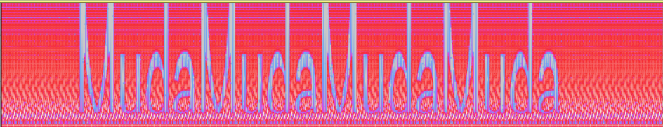

 # WriteUp
## Mediem

​	打开压缩包，得到一张png，发现疑似base64内容

```
RjAgOUYgOTkgODMgRjAgOUYgOTIgQjUgRjAgOUYgOEMgQkYgRjAgOUYgOEUgQTQgRjAgOUYgOUEgQUEgRjAgOUYgOEMgOEYgRjAgOUYgOTAgOEUgRjAgOUYgQTUgOEIgRjAgOUYgOUEgQUIgRjAgOUYgOTggODYgRTIgOUMgODUgRjAgOUYgOTggODAgRjAgOUYgQTQgQTMgRTIgOEMgQTggRjAgOUYgOTAgOEQgRTIgOTggODAgRjAgOUYgQTUgOEIgRjAgOUYgOTggODYgRjAgOUYgOTkgODMgRjAgOUYgOEUgODMgRjAgOUYgOTAgOTggRjAgOUYgOEQgOEQgRTIgOTggODIgRjAgOUYgOUEgQUEgRjAgOUYgOEMgQUEgRjAgOUYgOTIgQjUgRjAgOUYgOUEgQTggRTIgOEMgQTggRjAgOUYgOTggODEgRjAgOUYgOTQgQUEgRTIgOUMgOTYgRjAgOUYgOEUgODggRjAgOUYgOEMgOEYgRjAgOUYgOTQgODQgRjAgOUYgOTYgOTAgRjAgOUYgQTYgOTMgRjAgOUYgOEMgOEYgRjAgOUYgOTUgQjkgRjAgOUYgOTggOEQgRjAgOUYgOTEgOEMgRjAgOUYgOEMgODkgRjAgOUYgOTIgQjUgRjAgOUYgOEYgOEUgRjAgOUYgOUEgQUIgRjAgOUYgQTQgQTMgRjAgOUYgOTYgOTAgRjAgOUYgOTIgQTcgRjAgOUYgOEQgOEQgRjAgOUYgOEMgQkYgRjAgOUYgOTggOEQgRjAgOUYgOEQgOEUgRjAgOUYgOUEgQTggRjAgOUYgOTAgOEUgRjAgOUYgOTIgQjUgRjAgOUYgOEMgQkYgRjAgOUYgOEYgQjkgRjAgOUYgOEUgODUgRjAgOUYgOTkgODMgRjAgOUYgOTEgOTEgRjAgOUYgOTggODYgRTIgOTggODMgRjAgOUYgOTAgODUgRjAgOUYgOTUgQjkgRjAgOUYgOTggODcgRjAgOUYgOEYgQjkgRjAgOUYgOEYgQjkgRjAgOUYgOEQgQjUgRjAgOUYgOEUgODggRjAgOUYgOEQgOEUgRjAgOUYgQTQgQTMgRjAgOUYgOTggODEgRjAgOUYgOEQgOEQgRjAgOUYgOUEgQTggRjAgOUYgOEYgQjkgRjAgOUYgOTEgQTMgRjAgOUYgOTQgODQgRjAgOUYgQTQgQTMgRjAgOUYgOEUgODggRjAgOUYgOTggODIgRjAgOUYgOTAgOEQgRTIgOUMgODUgRjAgOUYgOTggODAgIEUyIDlDIDg1IEYwIDlGIDlBIEFBIEYwIDlGIDk4IDhFIEYwIDlGIDk4IDgwIEYwIDlGIDk3IDkyIEYwIDlGIDk3IDkyCg==
```

解密

```
F0 9F 99 83 F0 9F 92 B5 F0 9F 8C BF F0 9F 8E A4 F0 9F 9A AA F0 9F 8C 8F F0 9F 90 8E F0 9F A5 8B F0 9F 9A AB F0 9F 98 86 E2 9C 85 F0 9F 98 80 F0 9F A4 A3 E2 8C A8 F0 9F 90 8D E2 98 80 F0 9F A5 8B F0 9F 98 86 F0 9F 99 83 F0 9F 8E 83 F0 9F 90 98 F0 9F 8D 8D E2 98 82 F0 9F 9A AA F0 9F 8C AA F0 9F 92 B5 F0 9F 9A A8 E2 8C A8 F0 9F 98 81 F0 9F 94 AA E2 9C 96 F0 9F 8E 88 F0 9F 8C 8F F0 9F 94 84 F0 9F 96 90 F0 9F A6 93 F0 9F 8C 8F F0 9F 95 B9 F0 9F 98 8D F0 9F 91 8C F0 9F 8C 89 F0 9F 92 B5 F0 9F 8F 8E F0 9F 9A AB F0 9F A4 A3 F0 9F 96 90 F0 9F 92 A7 F0 9F 8D 8D F0 9F 8C BF F0 9F 98 8D F0 9F 8D 8E F0 9F 9A A8 F0 9F 90 8E F0 9F 92 B5 F0 9F 8C BF F0 9F 8F B9 F0 9F 8E 85 F0 9F 99 83 F0 9F 91 91 F0 9F 98 86 E2 98 83 F0 9F 90 85 F0 9F 95 B9 F0 9F 98 87 F0 9F 8F B9 F0 9F 8F B9 F0 9F 8D B5 F0 9F 8E 88 F0 9F 8D 8E F0 9F A4 A3 F0 9F 98 81 F0 9F 8D 8D F0 9F 9A A8 F0 9F 8F B9 F0 9F 91 A3 F0 9F 94 84 F0 9F A4 A3 F0 9F 8E 88 F0 9F 98 82 F0 9F 90 8D E2 9C 85 F0 9F 98 80  E2 9C 85 F0 9F 9A AA F0 9F 98 8E F0 9F 98 80 F0 9F 97 92 F0 9F 97 92
```

十六进制形式保存，得到AES密文

🙃💵🌿🎤🚪🌏🐎🥋🚫😆✅😀🤣⌨🐍☀🥋😆🙃🎃🐘🍍☂🚪🌪💵🚨⌨😁🔪✖🎈🌏🔄🖐🦓🌏🕹😍👌🌉💵🏎🚫🤣🖐💧🍍🌿😍🍎🚨🐎💵🌿🏹🎅🙃👑😆☃🐅🕹😇🏹🏹🍵🎈🍎🤣😁🍍🚨🏹👣🔄🤣🎈😂🐍✅😀✅🚪😎😀🗒🗒

这时解密需要密钥，密钥就在音频文件中，音频文件key.wav用audacity打开，切换成频谱图就看到了密钥



```
AES-密钥：MudaMudaMudaMuda
```

在线网站AES-emoji解密得到flag

## flag

``` 
flag{AES_1s_Gr3atS0_y0u_L1ke_1t_V3ry_Much}
```


